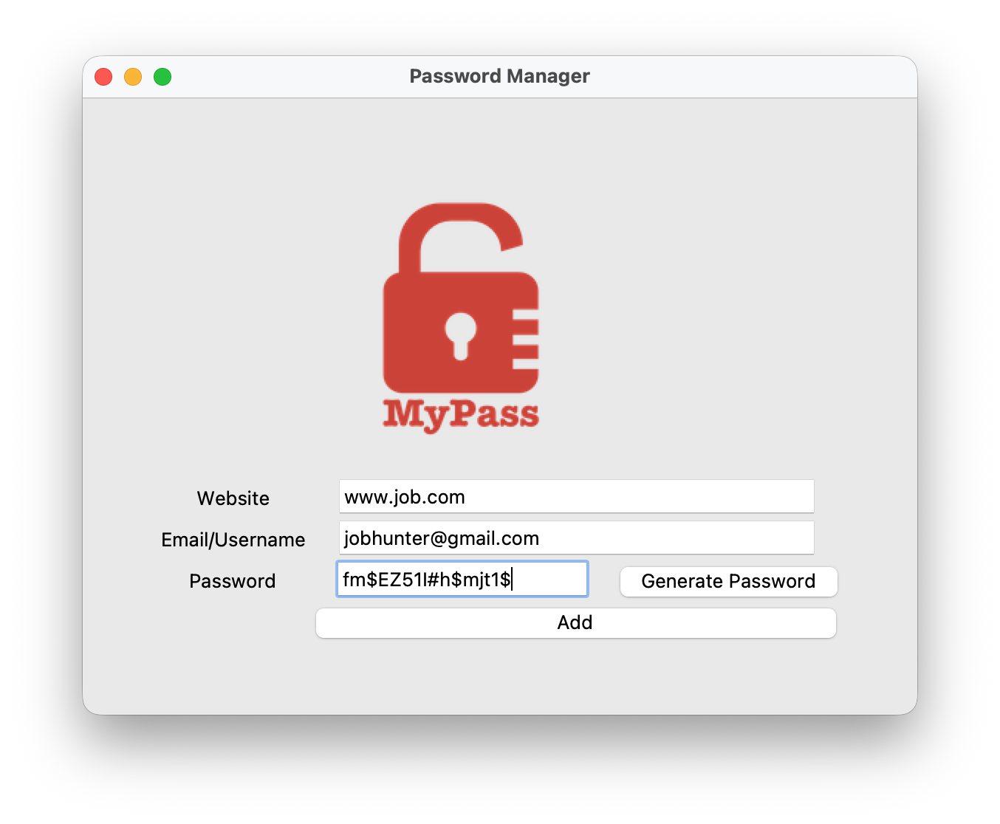

# Password Manager GUI

A secure and user-friendly desktop application for generating and storing passwords. Built with Python and the Tkinter library, this Password Manager provides a simple interface to help you manage your credentials for different websites locally.

## Demo



## Features

-   **Strong Password Generation:** Creates robust, randomized passwords containing a mix of letters, numbers, and symbols.
-   **One-Click Copy:** Generated passwords are automatically copied to the clipboard for immediate use.
-   **Local Storage:** Securely saves your website, username, and password details to a local `password.txt` file.
-   **User-Friendly Interface:** A clean and intuitive GUI makes it easy to add and manage your entries.
-   **Data Validation:** Prevents saving empty entries and includes a confirmation step to ensure data accuracy before saving.

## Project Setup

To run this application on your local machine, please follow the instructions below.

### Prerequisites

-   Python 3.x (Tkinter is part of the standard Python library).
-   `pip` (Python package installer).

### Installation

1.  **Clone the repository:**
    ```bash
    git clone https://github.com/dheerajdhami2001-cyber/password_manager.git
    ```

2.  **Navigate into the project directory:**
    ```bash
    cd password_manager
    ```

3.  **Install the required dependency:**
    This project uses the `pyperclip` library to handle copying text to the clipboard.
    ```bash
    pip install pyperclip
    ```

4.  **Run the application:**
    ```bash
    python main.py
    ```

## How It Works

-   **`main.py`**: The core script that runs the application.
    -   **Password Generator:** The `generate_password()` function creates a secure password by combining random selections of letters, numbers, and symbols, then shuffles them to ensure unpredictability.
    -   **Save Functionality:** The `save()` function validates the user's input, presents a confirmation dialog, and then appends the new credentials to the `password.txt` file.
    -   **UI Setup:** The user interface is constructed using Tkinter widgets, providing input fields for the website and username, and buttons to trigger the generate and save functions.

## Acknowledgments

This project was inspired by and completed with the guidance of the **[100 Days of Code: The Complete Python Pro Bootcamp](https://www.udemy.com/course/100-days-of-code/)** by Dr. Angela Yu.
